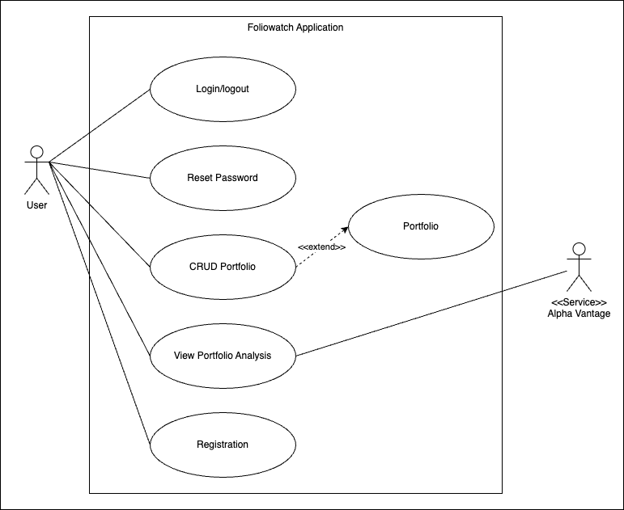
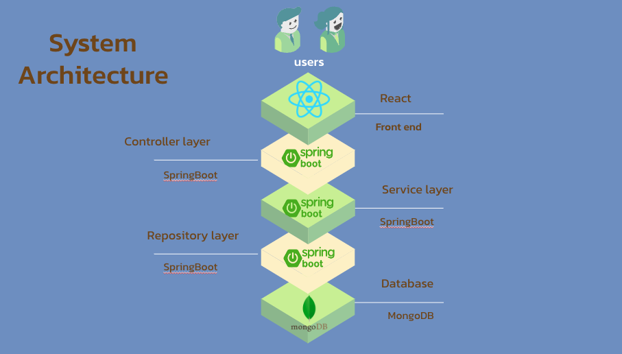
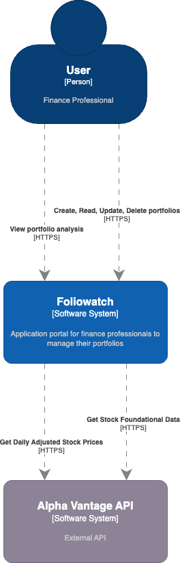
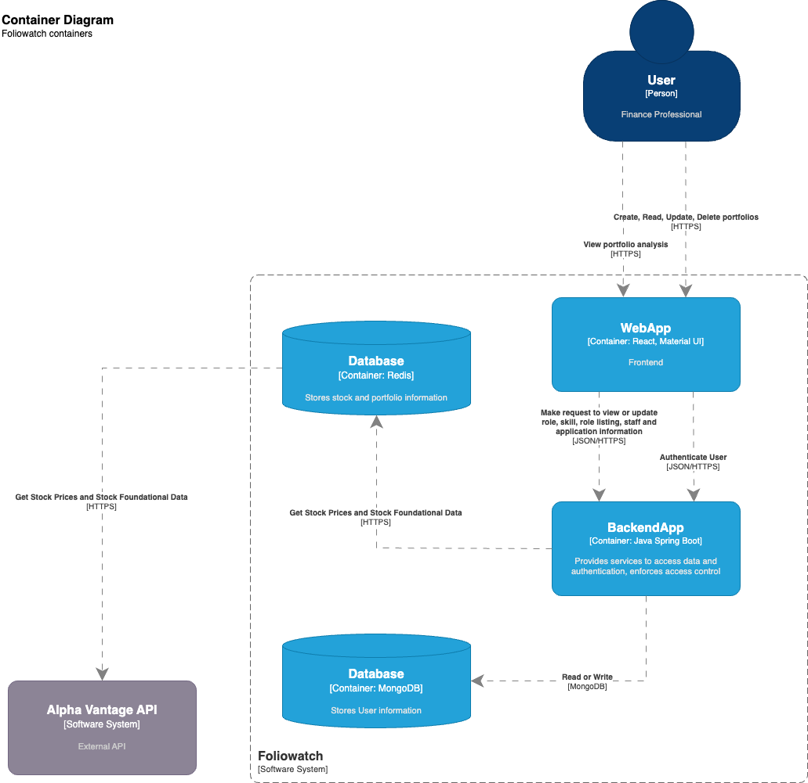

# Foliowatch

## Contributors
* Bella Leo
* Darrell Ng
* Darien Tan
* Eugene Toh
* Ivan Lim
* Jules Robins

## Project Overview
The Goldman Sachs Group, Inc. is a prominent global financial institution, offering a wide array of financial services to a diverse clientele, including corporations, financial institutions, governments, and individuals.

In light of this, we have been entrusted with the task of creating a robust system for investment advisors and finance professionals. This system's primary objective is to facilitate the analysis of investment portfolio performance and, in turn, empower users to make well-informed investment decisions.

The software will be equipped to gather, process, and present data in an intuitive and user-friendly manner. Users will have the capability to compare and assess different portfolios using essential metrics and performance indicators.

## Libraries Used
1. Java
2. Maven
3. Spring Boot
4. MongoDB
5. Redis
6. React

## Onboarding

### Installation

- Obtain the latest `.env` file and ensure that it is situated in the root directory of this repo.

### Running in production

- Build the Docker Compose image:

```bash
docker compose build
docker compose up -d
```

### Running in development

- Run the following command:

```bash
./mvnw spring-boot:run
```

### Developing Foliowatch

1. Open two terminals in your IDE. One of them will be used for developing the frontend and the other the backend.
2. For the frontend, navigate to the `frontend` folder (`cd frontend`) and run `npm run install`, then `npm run watch` to export the built files to Spring Boot.
3. For the backend, run `./mvnw spring-boot:run`. The website will be running in port 8080 by default. The application will be rebuilt if any Java source files are modified automatically. For the frontend, you will have to reload the page in your browser to realise any changes.
4. To get the Swagger OpenAPI documentation, navigate to `/api/docs/ui`.
5. To generate API fetching code for the frontend after adding new endpoints, run `npm run generate` in the `frontend` folder while the backend server is still running.

## Swagger
Documentation of an interactive, machine and human-readable API documentation.
`/api/docs/ui`


## Use Case Diagram


## Architecture Diagram


## Context Diagram


## Container Diagram


## ER Diagram
